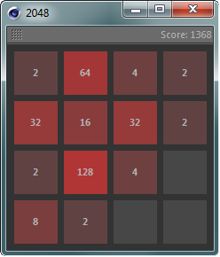

# 2048

This Cinema 4D plugin brings you 2048 to Cinema 4D. It is well documented
and a good learning resource for Python beginners in the field of GUI
development. Use the arrow keys to control the game, press ESC to reset it.

